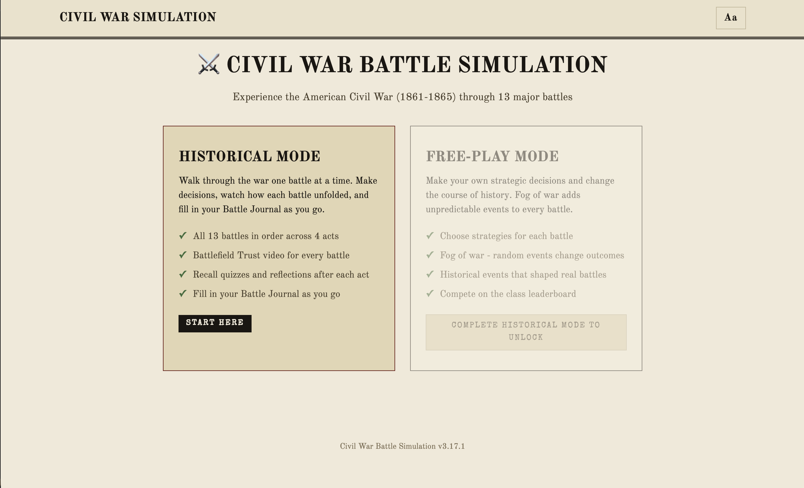

# Civil War Battle Simulation

*An 8th-grade history unit I built for my own classroom.*

I wanted to teach the Civil War in a way that's engaging, accurate, and gives students multiple ways to engage with the content — and multiple ways to struggle with it. Some students will scratch the surface and walk away with the main ideas. Others will dig in: read the primary-source voices, watch the battlefield videos, replay Free-play Mode for hours, argue about whether the Anaconda Plan or Emancipation Proclamation mattered more. Both kinds of students belong here.

The floor is the same for everyone: by the end of the unit, every student can explain who won the Civil War and give specific reasons why.

**Live site:** [civil.mrbsocialstudies.org](https://civil.mrbsocialstudies.org)

<!-- SCREENSHOT TRIPTYCH PLACEHOLDER
Once images/screenshots/ has the three files, replace this comment block with:

<table>
  <tr>
    <td align="center"></td>
    <td align="center"></td>
    <td align="center"></td>
  </tr>
  <tr>
    <td align="center"><sub>Students pick a side and a reading level.</sub></td>
    <td align="center"><sub>They make decisions and compare to history.</sub></td>
    <td align="center"><sub>They build an argument on paper.</sub></td>
  </tr>
</table>
-->

## Contents

- [How students use this](#how-students-use-this)
- [Reading levels and differentiation](#reading-levels-and-differentiation)
- [For educators](#for-educators)
- [Battle Journal handout](#battle-journal-handout)
- [Teacher Dashboard](#teacher-dashboard)
- [The 13 battles](#the-13-battles)
- [Primary source voices](#primary-source-voices)
- [Contribute, suggest, or just say hi](#contribute-suggest-or-just-say-hi)
- [Project structure](#project-structure)
- [Technical notes](#technical-notes)
- [Version history](#version-history)
- [Sources & credits](#sources--credits)

## How students use this

Students work through the 13 battles in **Historical Mode** while filling in a printed **Battle Journal** handout. The simulation and the handout are designed to work together. The game presents the evidence; the handout makes students synthesize an argument from it.

### The Battle Journal (paper handout)

The unit answers one question: **How was the Union able to defeat the Confederacy?**

The handout is two pages.

**Page 1** is an act-by-act evidence log organized around the four acts of the war:

- Act I: The War Begins (1861-1862, Fort Sumter through Shiloh)
- Act II: A New Kind of War (1862-1863, Antietam through Chancellorsville)
- Act III: The Tide Turns (1863, Vicksburg through Chickamauga)
- Act IV: The War's Legacy (1864-1865, Wilderness through Appomattox)

After each act of in-game battles, students stop and fill in that act's box: key events they want to remember, and why the act mattered for the Union. The simulation prompts them with a clear "Reflect on your Battle Journal" callout at every act review screen, so they aren't tempted to wait until the end.

**Page 2** builds the answer. Students see a Word Bank of 8 key terms (Anaconda Plan, Emancipation Proclamation, total war, and so on) which they circle as they encounter them during play. Then they:

1. Construct a three-part thesis: "The Union defeated the Confederacy because X, Y, and Z."
2. Cite a specific battle, person, or event as evidence for each reason.
3. Identify which Word Bank term they think was most important and explain why.
4. Write one sentence explaining why bravery and leadership alone were not enough for the Confederacy to win.

The handout ships in three tiers (Standard, Some Support, Extra Support) so students with different reading and writing supports are all answering the same essential question, just with different levels of scaffolding. The teacher prints whichever tier(s) match their students. There's no hard rule that a Beginner-tier player must get the Some Support handout. Some students need more support in writing than in reading, and vice versa, so the matching is left as a teacher's judgment call.

### Historical Mode (the simulation)

Students choose Union or Confederacy, pick a reading level, and play through all 13 battles. Each battle follows a four-step flow:

1. **Briefing.** Intel report and situation context for the battle they're about to face.
2. **Your Call.** A "What Would You Do?" decision with personalized feedback comparing their choice to the historical decision. The options shuffle so the historically correct answer isn't always in the same position.
3. **What Happened.** The historical outcome, plus three side panels: a Technology Spotlight (rifled musket, ironclads, telegraph, and so on), a primary-source Voice From the War (Sullivan Ballou, Clara Barton, Susie King Taylor, Sam Watkins, and others), and a Bigger Picture section with Perspectives sidebars on race, class, gender, and Indigenous experiences. Each sub-section ends with a Note Nudge pointing students to a specific fact worth recording in their Battle Journal.
4. **Reflect.** A "Reflect on your Battle Journal" callout. For most battles this is a short pause to update the handout. After the final battle of each act (Shiloh, Chancellorsville, Chickamauga, Appomattox), this step expands into an **act review**: a three-question multiple-choice recall moment drawn from that act's content, followed by a grouped reflection prompt on the act's bigger themes. The act review is also where the handout-nudge banner appears.

After all 13 battles, students reach a final summary screen. Their argument lives on the paper handout, which the teacher collects.

### Free-play Mode (unlocked after Historical Mode)

Once a student completes Historical Mode, Free-play Mode unlocks on the start screen. This is a strategic replay where their decisions actually shape outcomes:

- **Momentum system:** victories build power, defeats erode it.
- **Fog of war:** random events change battle outcomes unpredictably.
- **Historical events:** side-dependent modifiers based on real events (e.g., finding Lee's lost orders at Antietam).
- **Class leaderboard:** a Firebase-powered shared leaderboard with room codes, plus a local top-10 fallback if Firebase is unreachable.

Free-play is the engagement reward, not the assessment. The Battle Journal handout is the assessment.

## Reading levels and differentiation

The simulation ships every battle in **four reading-level tiers** so students with different reading and writing supports can all engage with the same historical content:

- **Extra Support (E)** — written at roughly a 1st-3rd grade reading level for ML/IEP students underserved by typical "beginner" tiers. The Intel grid, Technology Spotlight, and Key Fact panels are hidden; the Voice From the War quote ships with a plain-English explainer; the Bigger Picture and Voice sections start collapsed with a "tap to read" hint so the screen isn't a wall of text.
- **Beginner (B)** — written at roughly a 5th-6th grade reading level. Same structural simplifications as Extra Support, with grade-appropriate vocabulary.
- **Intermediate (I)** — on-grade 8th-grade level. This is the default experience: all sections visible, Perspectives sidebars hidden to keep cognitive load reasonable.
- **Advanced (A)** — written for stronger readers. All sections visible including Perspectives sidebars. Reflection prompts (in the grouped reflection moments) use RACE method reminders (Restate, Answer, Cite, Explain) instead of sentence starters.

Two things make this work in a real classroom:

1. **Switch tier mid-game.** The toolbar shows E/B/I/A pills at all times. A student who picked Beginner at the start screen but finds it patronizing — or picked Advanced and is drowning — can change tiers at any moment without losing progress, including mid-battle, mid-recall, or mid-reflection. The chosen tier persists in localStorage.

2. **Content fallback chain.** When a battle field is missing in a tier (which can happen during authoring), the game falls back gracefully: Extra Support → Beginner → Intermediate. The student never sees an empty section.

## For educators

- Designed for 8th-grade history classes; aligns loosely with Washington State Social Studies Learning Standards and the Since Time Immemorial framework on Indigenous perspectives. Alignment notes for other states are welcome (see Contribute below).
- No installation required — runs in any web browser.
- Works on classroom Chromebooks and tablets without a server.
- Four reading levels with adaptive content and mid-game tier switching.
- OpenDyslexic font toggle, font size scale, and read-aloud voice/rate controls via the accessibility panel.
- Screen reader support and keyboard navigation.
- Printable Battle Journal handout in three differentiation tiers.
- **Teacher Dashboard** at `/teacher.html` (password-gated) shows where every student in each class period is in real time, with per-student and clear-all controls. See the Teacher Dashboard section below.
- **Battlefield Tours** embed curated American Battlefield Trust videos (10 Animated Maps, 3 Documentaries) for every battle, surfacing on the post-battle results screen at the moment of maximum curiosity.

## Battle Journal handout

A printable companion handout students fill in during Historical Mode. Captures battle evidence by act, then scaffolds a thesis-and-evidence response to "How was the Union able to defeat the Confederacy?" Available in three tiers, all large-text, two pages each. Open in a browser and click the Print Handout button at the top.

- **Standard:** [civil.mrbsocialstudies.org/handouts/battle-journal-standard.html](https://civil.mrbsocialstudies.org/handouts/battle-journal-standard.html) — on-grade 8th-grade level, 8 vocabulary terms in Word Bank
- **Some Support:** [civil.mrbsocialstudies.org/handouts/battle-journal-some-support.html](https://civil.mrbsocialstudies.org/handouts/battle-journal-some-support.html) — 5-6th grade level, sentence stems on every prompt
- **Extra Support:** [civil.mrbsocialstudies.org/handouts/battle-journal-extra-support.html](https://civil.mrbsocialstudies.org/handouts/battle-journal-extra-support.html) — 1-3rd grade level, 6 Word Bank terms with plain-language definitions

The in-game act review screens (one per act, four total) display a banner reminding students to fill in that act's box before continuing.

## Teacher Dashboard

A standalone page at `/teacher.html` that shows live progress for every student in your class. As students play, the dashboard updates within a second or two. Features:

- Live student chips for every period (P1, P2, P4, P5), grouped by current battle.
- Sort modes: by Battle, by Period, or by Name. Period filter pills.
- Chip dims after 5 minutes of inactivity to flag stuck or disconnected students.
- Per-student delete (✕ on hover) and Clear All (between units).
- Password-gated on page load; session-scoped so it only prompts once per browser tab.

Students opt into being tracked by entering a **class code** (e.g. `AMS-p1`) on the name entry form. No code = no dashboard write. A banner in the game offers a way back in if a student starts without one. Codes are distributed out-of-band by the teacher (whiteboard, Google Classroom). To rotate codes, edit four strings in `js/firebase-leaderboard.js` and delete the old `rooms/<oldcode>/progress` trees from the Firebase console.

This is intentionally lightweight authentication. The class code keeps the dashboard clean; the dashboard password keeps casual snoopers out. Real authentication via Firebase Auth or Google Workspace SSO is on the wishlist but blocked by district policy at the moment.

## The 13 battles

<details>
<summary>Expand the battle list</summary>

| # | Battle | Year | Key Theme |
|---|--------|------|-----------|
| 1 | Fort Sumter | 1861 | The war begins |
| 2 | Bull Run | 1861 | The myth of a short war dies |
| 3 | Shiloh | 1862 | Industrial-scale carnage |
| 4 | Antietam | 1862 | Emancipation Proclamation |
| 5 | Fredericksburg | 1862 | Irish Brigade, class tensions |
| 6 | Chancellorsville | 1863 | Black troops and women serving |
| 7 | Vicksburg | 1863 | The Confederacy split in two |
| 8 | Gettysburg | 1863 | 54th Massachusetts, Draft Riots |
| 9 | Chickamauga | 1863 | The bloodiest day in the West |
| 10 | Wilderness | 1864 | Grant's relentless campaign |
| 11 | Atlanta | 1864 | Lincoln's re-election secured |
| 12 | Sherman's March | 1864 | Total war and its consequences |
| 13 | Appomattox | 1865 | Surrender, assassination, 13th Amendment |

</details>

## Primary source voices

<details>
<summary>Expand the list of voices featured in the game</summary>

The game features primary source quotes from diverse perspectives:

- **Chaplain John Eaton** — Freedpeople fleeing to Union lines (Shiloh)
- **Sullivan Ballou** — Union officer's letter to his wife (Bull Run)
- **Clara Barton** — Volunteer nurse on the battlefield (Antietam)
- **Captain William J. Nagle** — Irish Brigade at Fredericksburg
- **Susie King Taylor** — Black nurse and teacher with the 33rd USCT (Chancellorsville)
- **Corporal James Henry Gooding** — 54th Massachusetts, letter to Lincoln demanding equal pay (Wilderness)
- **Sam Watkins** — Confederate enlisted soldier (Chickamauga)
- **Mary Chesnut** — Senator's wife, diarist (Fort Sumter)
- **Dora Miller** — Civilian under siege (Vicksburg)
- **Dolly Sumner Lunt** — Plantation owner during Sherman's March
- And more...

</details>

## Contribute, suggest, or just say hi

This is built by one teacher (hi, I'm Shie) for actual 8th-grade classrooms. I'd love feedback from anyone using it or thinking about using it — other social studies teachers, students, parents, historians, accessibility specialists, or developers. A few specific things I'd find valuable:

**For teachers using or considering this with your students:**
- What worked, what bombed, what your kids actually said
- Battles or moments where the framing feels off, missing, or one-sided
- Differentiation tiers that need more (or less) support
- How it slotted into your unit and what you wish it did differently

**For history educators and content experts:**
- Primary-source suggestions, especially voices underrepresented in standard textbooks
- Factual corrections or framings that mislead even when technically accurate
- Connections to specific state standards (I teach in Washington State and align loosely to WA Social Studies Learning Standards plus the Since Time Immemorial framework — alignment notes for other states are welcome)

**For accessibility specialists, ML/IEP teachers, and ELL teachers:**
- Where the Extra Support tier still asks too much
- Screen reader or keyboard navigation issues
- Translation or multilingual support requests (currently English only)

**For developers:**
- Bug reports via [GitHub Issues](https://github.com/shiebenaderet/civil-war-battle-simulation/issues)
- Pull requests welcome for clear bugs, accessibility improvements, or print-handout fixes. For anything touching pedagogy, content, or differentiation, please email first so we can talk through the change before you build it.

**How to reach me:**
- Email: shie@benaderet.com (best for substantive feedback, classroom stories, content suggestions)
- GitHub Issues: [github.com/shiebenaderet/civil-war-battle-simulation/issues](https://github.com/shiebenaderet/civil-war-battle-simulation/issues) (best for bugs, broken links, technical problems)

If you do use this in your classroom, even just once, I'd really like to hear how it went. There's no formal study, no analytics, no tracking — just a teacher trying to build something useful and wanting to know if it actually was.

## Project structure

<details>
<summary>Expand the file tree</summary>

```
civil-war-battle-simulation/
├── index.html              # Student-facing app: markup, screens, inline theme script
├── teacher.html            # Standalone teacher dashboard (password-gated)
├── favicon.svg             # Site icon
├── css/
│   └── styles.css          # Design tokens, components, layouts
├── js/
│   ├── data/
│   │   ├── battles.js      # 13 battles with historical + freeplay data, all 4 reading tiers
│   │   ├── acts.js         # Act intros, recall questions, grouped reflections
│   │   ├── leaders.js      # Lincoln & Davis personalized letters
│   │   └── maps.js         # SVG battle maps
│   ├── firebase-leaderboard.js  # Firebase wrapper: room codes, class leaderboard, teacher dashboard writes
│   ├── game.js             # State, save/load, momentum, fog of war, scoreboard
│   ├── ui.js               # Screen management, rendering, DOM, tutorial, banners
│   ├── app.js              # Init, event wiring, screen flow
│   ├── tts.js              # Read-aloud voice controls (accessibility panel)
│   ├── settings.js         # Settings menu wiring
│   └── print-summary.js    # Legacy print-summary generator (unwired; kept for one release)
├── images/                 # Public domain artwork (Library of Congress, National Archives, Wikimedia Commons)
├── handouts/               # Printable Battle Journal in 3 differentiation tiers
├── docs/superpowers/       # Specs and implementation plans for major features
├── mockups/                # Design mockups
└── README.md
```

</details>

## Technical notes

- **No frameworks, no build tools** — pure HTML, CSS, and vanilla JavaScript.
- **No ES modules** — works with `file://` protocol for offline classroom use.
- **GitHub Pages deployment** — push to main branch to deploy.
- **localStorage** for persistence (game saves, leaderboard, theme preference, class code, reading level).
- **Firebase Realtime Database** for the class leaderboard and the teacher dashboard. Gracefully degrades to local-only when offline.
- Scripts load in dependency order: data files → game logic → Firebase → UI → app init.

## Version history

<details>
<summary>Expand version history</summary>

- **v3.18 (in progress)** - Per-period room codes for the teacher dashboard. Replaces the single shared room code with four per-period codes (AMS-p1 through AMS-p5) and adds password-gated delete/clear controls on the dashboard. Strangers from other classrooms no longer appear in the dashboard because every dashboard write now requires a valid class code. New student-facing class code field (masked) on the name entry form, plus a "your teacher won't see your progress" banner with inline code entry for kids who skip it. Dashboard subscribes to all four period rooms in parallel and merges entries.
- **v3.17.1** - Handout-first reflection cleanup. The in-app reflection textarea, sentence-starter chips, RACE reminder, and "Need a hint?" tip are hidden; a clear "Reflect on your Battle Journal" callout replaces the typing UI. PDF export retired since the handout is the only capture surface now. Teacher Jump-to-Battle hidden recovery shortcut: type `jump` anywhere outside a text input to open a battle picker.
- **v3.17.0** - Battlefield Tours + Teacher Dashboard. Curated American Battlefield Trust videos (10 Animated Maps, 3 Documentaries) for every battle, surfacing on the post-battle results screen. New standalone /teacher.html shows live student progress with sort and filter controls.
- **v3.16.0** - Extra Support reading tier added (fourth tier alongside Beginner / Intermediate / Advanced) for ML/IEP students. All 13 battles, 4 acts, leader letters, and reflection prompts ship in ES.
- **v3.15.x** - Launch polish. Toolbar redesigned with always-visible reading-level pills (mid-game tier switching). Accessibility panel: OpenDyslexic font, font size scale, read-aloud voice controls. Reset This Battle, browser refresh warning, settings menu cleanup. Battle Journal handout added in three differentiation tiers with Confederate-side tonal fixes.
- **v3.14.0** - Battle Screen reshape. Step 2 splits into Feedback / Outcome / Reflection-from-history sub-steps; per-sub-screen note nudges (117 total) point students at specific facts worth journaling. Act review study guides for all 4 acts at 3 reading levels.
- **v3.12.x** - Acts of the War. Animated act intros before battles 0, 3, 6, 9. Recall moment (3 multiple-choice questions per act) before each grouped reflection.
- **v3.11.0** - Documentary Pass. Full visual reset from Blooket-inspired aesthetic to Field Report (period newspaper) aesthetic with Old Standard TT serif and Special Elite typewriter accents.
- **v3.10.0** - Free-play overhaul: all 39 freeplay strategies have side-specific text. Esri StoryMaps Civil War timeline replaced ArcGIS war map.
- **v3.9.0** - Fixed critical WWYD match logic across 7 battle scenarios where the historical choice was at the wrong option index.
- **v3.7.x** - Firebase-powered class leaderboard with room codes. Progressive reveal animations. PDF export with match tracking (since retired in v3.17.1).
- **v3.6.x** - Redesigned WWYD feedback with match/different badges. Grouped reflections every 3-4 battles around bigger themes.
- **v3.5.x** - Guided tutorial system. Difficulty levels stop referencing grade levels to avoid stigma.
- **v3.4.x** - Three-level difficulty system (Beginner / Intermediate / Advanced — Extra Support added later in v3.16). Reflection scaffolding. Battle maps from Wikimedia Commons.

Earlier history (v3.0 - v3.3): two-mode system established, momentum system, Blooket-inspired UI, primary source voices, Perspectives sidebars.

</details>

## Sources & credits

All battles and strategies are based on historical events. Primary source quotes are drawn from the Library of Congress, National Archives, Freedmen and Southern Society Project, and published memoirs. All images are in the public domain. Battlefield Tours videos are hosted by the American Battlefield Trust and embedded under their public-facing YouTube channel.
