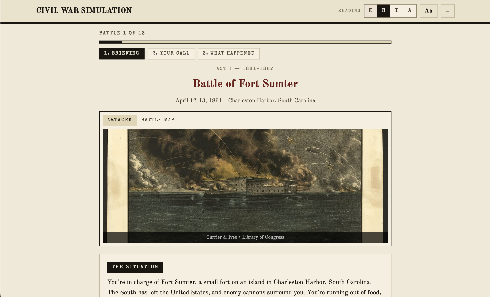
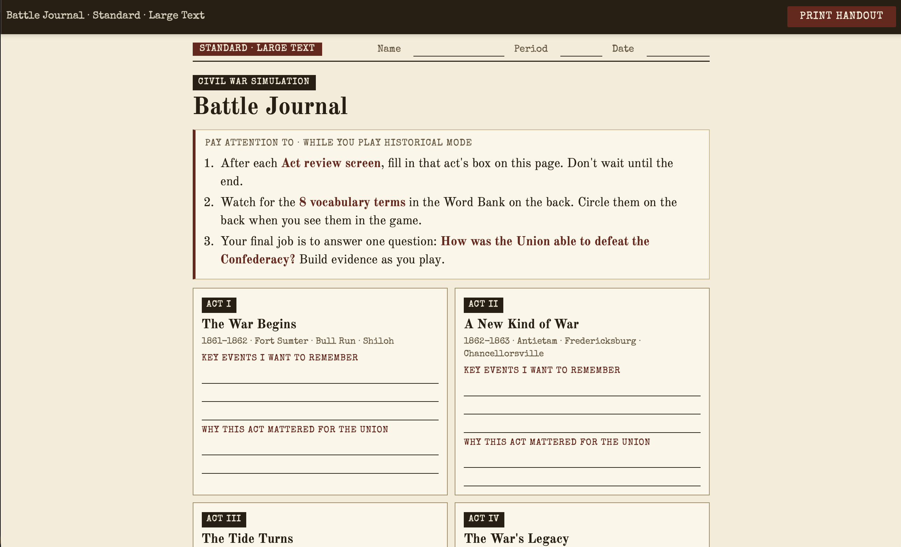

# Civil War Battle Simulation

*An 8th-grade history unit I built for my own classroom.*

I wanted to teach the Civil War in a way that's engaging, accurate, and gives students multiple ways to engage with the content, and multiple ways to struggle with it. Some students will scratch the surface and walk away with the main ideas. Others will dig in: read the primary-source voices, watch the battlefield videos, replay Free-play Mode for hours, argue about whether the Anaconda Plan or Emancipation Proclamation mattered more. Both kinds of students belong here.

The floor is the same for everyone: by the end of the unit, every student can explain who won the Civil War and give specific reasons why.

**Live site:** [civil.mrbsocialstudies.org](https://civil.mrbsocialstudies.org)

<table>
  <tr>
    <td align="center" width="33%"></td>
    <td align="center" width="33%"></td>
    <td align="center" width="33%"></td>
  </tr>
  <tr>
    <td align="center"><sub>Students enter a name and reading level, then begin.</sub></td>
    <td align="center"><sub>Each battle opens with period artwork and historical context.</sub></td>
    <td align="center"><sub>They build their answer on paper, act by act.</sub></td>
  </tr>
</table>

## Contents

- [How students use this](#how-students-use-this)
- [Reading levels and differentiation](#reading-levels-and-differentiation)
- [For educators](#for-educators)
- [Battle Journal handout](#battle-journal-handout)
- [Teacher Dashboard](#teacher-dashboard)
- [The 13 battles (with companion videos)](#the-13-battles)
- [Primary source voices](#primary-source-voices)
- [Contribute, suggest, or just say hi](#contribute-suggest-or-just-say-hi)
- [Project structure](#project-structure)
- [Technical notes](#technical-notes)
- [Version history](#version-history)
- [Sources & credits](#sources--credits)

## How students use this

Students work through the 13 battles in **Historical Mode** while filling in a printed **Battle Journal** handout. The simulation and the handout are designed to work together. The game presents the evidence; the handout makes students synthesize an argument from it.

### The Battle Journal (paper handout)

The unit answers one question: **How was the Union able to defeat the Confederacy?**

The handout is a single coherent flow in three parts. It is built around the four acts of the war:

- Act I: The War Begins (1861-1862, Fort Sumter through Shiloh)
- Act II: A New Kind of War (1862-1863, Antietam through Chancellorsville)
- Act III: The Tide Turns (1863, Vicksburg through Chickamauga)
- Act IV: The War's Legacy (1864-1865, Wilderness through Appomattox)

**Part 1, Battle Log.** One row per battle, grouped by act. For each battle the student records the choice they made, checks "Matched history? Yes/No," and writes a short "why it mattered" summary in their own words. They do not copy: the game gives them a key idea on screen and they summarize it. The simulation prompts them with a "Key idea, write this in your journal" callout on every battle so they aren't tempted to wait until the end.

**Part 2, Act Checkpoints.** After each act, students answer that act's reflection question, then add a bridge line: "one way this act helped the Union win." Those four bridge lines bank the evidence they'll need at the end.

**Part 3, Final Answer.** The thesis builder for "How was the Union able to defeat the Confederacy?" It now pulls straight from the four act-checkpoint evidence lines (the prompt reminds them, "you already have your evidence"). Students see a Word Bank of 8 key terms (Anaconda Plan, Emancipation Proclamation, total war, and so on) which they circle as they encounter them during play. Then they:

1. Construct a three-part thesis: "The Union defeated the Confederacy because X, Y, and Z."
2. Cite a specific battle, person, or event as evidence for each reason.
3. Identify which Word Bank term they think was most important and explain why.
4. Write one sentence explaining why bravery and leadership alone were not enough for the Confederacy to win.

The handout ships in four tiers (Most Support, More Support, Standard, Extra Challenge) so students with different reading and writing supports are all answering the same essential question, just with different levels of scaffolding. Two things scale with the tier:

- **Scaffolding.** Most Support has fill-in-the-blank sentences and sentence stems above the write-lines. More Support has stems above the lines. Standard has fewer, and Extra Challenge has the least. All four keep the 8-term Word Bank.
- **Writing load.** Everyone plays all 13 battles, but lower tiers log fewer of them. Most Support logs 4 anchor battles (one per act), More Support logs 8 (two per act), and Standard and Extra Challenge log all 13.

The teacher prints whichever tier(s) match their students. There's no hard rule that a More Support player must get the More Support handout. Some students need more support in writing than in reading, and vice versa, so the matching is left as a teacher's judgment call.

### Historical Mode (the simulation)

The app boots straight to mode selection (no intro splash). In Historical Mode students always play the Union, so there's no side to pick. A short setup screen greets them ("Welcome, Commander"), takes their name and reading level, and a "Begin Your Journey" button drops them into the war. They play through all 13 battles. Each battle follows a four-step flow:

1. **Briefing.** Intel report and situation context for the battle they're about to face.
2. **Your Call.** A "What Would You Do?" decision with personalized feedback comparing their choice to the historical decision. The options shuffle so the historically correct answer isn't always in the same position.
3. **What Happened.** The historical outcome, led by a prominent "Key idea, write this in your journal" callout. Every tier sees this callout: it's the per-battle key idea students summarize on the handout in their own words. The deeper content sits behind three folder-style tabs the student can click through if they want more: A Voice From the Field (a primary-source voice such as Sullivan Ballou, Clara Barton, Susie King Taylor, or Sam Watkins), The Bigger Picture (with Perspectives sidebars on race, class, gender, and Indigenous experiences), and Technology Spotlight (rifled musket, ironclads, telegraph, and so on). The Battlefield Trust video shows as a small thumbnail.
4. **Reflect.** A "Reflect on your Battle Journal" callout. For most battles this is a short pause to update the handout. After the final battle of each act (Shiloh, Chancellorsville, Chickamauga, Appomattox), this step expands into an **act review**: a three-question multiple-choice recall moment drawn from that act's content, followed by a grouped reflection prompt on the act's bigger themes. The act review is also where the handout-nudge banner appears. The recall options shuffle position each session, and all four options in a question are written to a similar length so the correct answer can't be guessed by picking the longest one. A teacher can see which recall questions students miss most on the dashboard's Questions tab.

During a battle, the current act and years (e.g. "Act II · 1862-1863") show centered in the top bar. Clicking that label, or the Campaign Log in the menu, opens the campaign log. From there a student can click any battle they've already finished to open a read-only review of it (what they picked versus what happened, the key idea, the bigger picture). That lets them catch up their handout without losing their place; it does not change their progress.

After all 13 battles, students reach a final summary screen. Their argument lives on the paper handout, which the teacher collects.

### Free-play Mode (unlocked after Historical Mode)

Once a student completes Historical Mode, Free-play Mode unlocks on the start screen. This is a strategic replay where their decisions actually shape outcomes. In v3.20 it got a lot deeper, and it now matches Historical Mode for accessibility.

**How the war is won or lost:**

- **Momentum system:** victories build power, defeats erode it.
- **Fog of war:** random events change battle outcomes unpredictably.
- **Historical events:** side-dependent modifiers based on real events (e.g., finding Lee's lost orders at Antietam).
- **Underdog comeback bonus:** when a player falls behind (negative momentum), they get a small boost so an early stumble isn't fatal. This softens the old death-spiral where one bad battle decided everything.
- **Troops now matter:** the soldiers stat used to be cosmetic. Now if a side bleeds its army below a floor (Union 400,000, Confederacy 250,000), the war ends in an attrition defeat no matter how momentum looks. Reckless, high-casualty play can lose you the war even while you're "winning."
- **Final-battle decider:** if the war is still close going into the last battle, that battle is framed as the decisive one and its momentum swing is doubled, so the final choice actually decides the war.
- **Class leaderboard:** a Firebase-powered shared leaderboard with room codes, plus a local top-10 fallback if Firebase is unreachable. It's now a **Leaderboard** item in the menu that opens anytime (the device top-10 plus the class room-code board), instead of only appearing on the end-of-game screen after a full campaign.

**The end-of-campaign screen:**

- **"Did You Change History?" overview:** after a Free-play campaign, a panel compares the player's run to the real Civil War: who won (and whether that matched history), how long the war lasted (an early end versus the full 13 battles), the cost in lives, and the single biggest way they diverged from (or matched) history.
- **Victory ratings:** the end screen grades the outcome (Crushing Victory, Clear Victory, Narrow Victory, Stalemate, Defeat, Decisive Defeat, or Costly Defeat for an army destroyed by attrition).

**Accessibility parity with Historical Mode (new in v3.20):**

- Read-aloud (text-to-speech) buttons now appear on Free-play battle briefings and results. They were Historical-only before.
- All 13 Free-play battle briefings are now written in all four reading-level tiers (Most Support, More Support, Standard, Extra Challenge), like Historical content. Changing the reading-level pill updates the briefing live.
- The Free-play strategy choices (each decision's name, description, and detail) are now written in all four reading levels too, so struggling readers get simpler strategy text. Changing the reading pill updates the decisions live as well.
- The current battle's act and years show in the top navigation bar during Free-play (it used to be Historical-only), and clicking it opens the campaign log.
- The Free-play battle progress bar moved to the bottom of the screen to match the Historical Mode layout.

Free-play is the engagement reward, not the assessment. The Battle Journal handout is the assessment.

## Reading levels and differentiation

The simulation ships every battle in **four reading-level tiers**, shown as 1 to 4 stars with a plain support-level name, so students with different reading and writing supports can all engage with the same historical content:

- **★ Most Support** (`extra`): written at roughly a 1st-3rd grade reading level for ML/IEP students underserved by typical "beginner" tiers. The Intel grid, Technology Spotlight, and Key Fact panels are hidden; the Voice From the Field quote ships with a plain-English explainer; the Bigger Picture and Voice tabs keep the screen from becoming a wall of text.
- **★★ More Support** (`beginner`): written at roughly a 5th-6th grade reading level. Same structural simplifications as Most Support, with grade-appropriate vocabulary.
- **★★★ Standard** (`intermediate`): on-grade 8th-grade level. This is the default experience: all sections available, Perspectives sidebars hidden to keep cognitive load reasonable.
- **★★★★ Extra Challenge** (`advanced`): written for stronger readers. All sections available including Perspectives sidebars. Reflection prompts (in the grouped reflection moments) use RACE method reminders (Restate, Answer, Cite, Explain) instead of sentence starters.

(The names in parentheses are the internal data keys, unchanged.)

Two things make this work in a real classroom:

1. **Switch tier mid-battle.** The toolbar shows the four star pills (★ to ★★★★) at all times, with the tier name in the tooltip. A student who picked More Support at the start but finds it patronizing, or picked Extra Challenge and is drowning, can change tiers at any moment without losing progress. It now keeps their exact step in the battle, too (it used to jump back to the start of the battle; that's fixed). Switching works mid-battle, mid-recall, or mid-reflection, and the chosen tier persists in localStorage.

2. **Content fallback chain.** When a battle field is missing in a tier (which can happen during authoring), the game falls back gracefully: Most Support → More Support → Standard. The student never sees an empty section.

### Vocabulary glossary (click to define)

25 key unit terms (Emancipation Proclamation, Anaconda Plan, 54th Massachusetts, habeas corpus, total war, plus the generals and presidents) are auto-highlighted in the game's reading text. A student clicks a highlighted term to see a plain-language definition in a popup. Common words like Union, Confederacy, and the major figures link on their first appearance per screen; rarer, more distinctive terms link every time. The glossary works on the battle text, the key ideas, the bigger picture, the voices, and the read-only battle-review screens.

## For educators

- Designed for 8th-grade history classes; aligns loosely with Washington State Social Studies Learning Standards and the Since Time Immemorial framework on Indigenous perspectives. Alignment notes for other states are welcome (see Contribute below).
- No installation required: runs in any web browser.
- Works on classroom Chromebooks and tablets without a server.
- Four reading levels (★ Most Support to ★★★★ Extra Challenge) with adaptive content and mid-battle tier switching that keeps the student's place.
- A 25-term vocabulary glossary with click-to-define tooltips on the reading text (see Reading levels and differentiation above).
- Students can revisit any completed battle read-only from the campaign log to catch up their handout, without losing their place or changing their progress.
- OpenDyslexic font toggle, font size scale, and read-aloud voice/rate controls via the accessibility panel.
- **Read-aloud (text-to-speech) is broadly available.** Play buttons appear on the main battle reading text and, as of v3.20, on the leader's letter, act introductions, the primary-source voice quotes, the Technology Spotlight, the battle-review screens, and (with the rest of the Free-play accessibility work) on Free-play battle briefings and results.
- Screen reader support and keyboard navigation.
- Printable Battle Journal handout in four differentiation tiers.
- The Help menu has an "Email Mr. B" button (a mailto link) and a "Send Feedback" button (prompts for a comment and emails it with the student's current screen and reading level attached) for students who want to reach the teacher.
- **Teacher Dashboard** at `/teacher.html` (password-gated) shows where every student in each class period is in real time, plus class and cross-school leaderboards and a per-question difficulty view. See the Teacher Dashboard section below.
- **Battlefield Tours** embed curated American Battlefield Trust videos (10 Animated Maps, 3 Documentaries) for every battle, surfacing on the post-battle results screen at the moment of maximum curiosity.
- **Visitor guest book + world map:** students who finish Historical Mode can add their school and location (dropdowns, no IP tracking) to a world map of everyone who has played, shown on the finish screen and in the Leaderboard. Teacher-moderated from the dashboard's Guest Book tab.

## Battle Journal handout

A printable companion handout students fill in during Historical Mode. It runs as a single flow: a per-battle log, then an act checkpoint after each act, then the final thesis-and-evidence answer to "How was the Union able to defeat the Confederacy?" Available in four tiers, all large-text. Open in a browser and use the toolbar at the top: **Print Handout** to print, or **Download PDF** to grab a clean, pre-rendered PDF with no browser headers/footers. (Regenerating those PDFs after editing a handout's HTML is documented in `handouts/README.md`.)

- **★ Most Support:** [civil.mrbsocialstudies.org/handouts/battle-journal-extra-support.html](https://civil.mrbsocialstudies.org/handouts/battle-journal-extra-support.html) (1-3rd grade level, fill-in-the-blank sentences and sentence stems above the write-lines, 8 Word Bank terms with plain-language definitions, logs 4 anchor battles, one per act)
- **★★ More Support:** [civil.mrbsocialstudies.org/handouts/battle-journal-some-support.html](https://civil.mrbsocialstudies.org/handouts/battle-journal-some-support.html) (5-6th grade level, sentence stems above the lines, 8 Word Bank terms, logs 8 battles, two per act)
- **★★★ Standard:** [civil.mrbsocialstudies.org/handouts/battle-journal-standard.html](https://civil.mrbsocialstudies.org/handouts/battle-journal-standard.html) (on-grade 8th-grade level, 8 vocabulary terms in Word Bank, logs all 13 battles)
- **★★★★ Extra Challenge:** [civil.mrbsocialstudies.org/handouts/battle-journal-advanced.html](https://civil.mrbsocialstudies.org/handouts/battle-journal-advanced.html) (for stronger writers, the least scaffolding, 8 Word Bank terms, logs all 13 battles)

Everyone plays all 13 battles; the lower tiers just log fewer of them to keep the writing load reasonable. The in-game act review screens (one per act, four total) display a banner reminding students to fill in that act's checkpoint before continuing.

## Teacher Dashboard

A standalone page at `/teacher.html` that shows live progress for every student in your class. As students play, the dashboard updates within a second or two. It is organized into four tabs:

- **Progress** (the default live view): student chips for every period (P1, P2, P4, P5), grouped by current battle. Sort by Battle, Period, or Name; filter by period. A chip dims after 5 minutes of inactivity to flag stuck or disconnected students. Per-student delete (✕ on hover) and Clear All (between units, which also clears question results).
- **Leaderboard:** your classes' high scores across all period rooms, with teacher delete and rename controls.
- **Global:** the public, cross-school leaderboard. Every finished game anywhere (including anonymous visitors from other schools) posts here, so you can see players beyond your own classes. Same delete/rename moderation controls. Names are self-entered and unverified, and there is no school or location field, so "another school" is an inference from an unfamiliar name, not a verified attribute.
- **Questions:** per-question difficulty. For each act-review recall question it shows how many students answered it and the **first-try miss rate** (the share who got it wrong on their first attempt, even if they later got it right), sorted worst-first and respecting the period filter. Click a row to expand the names of the students who missed it on first try. This is the view for spotting which content to reteach. Question results are written to Firebase only for students with a valid class code, same as Progress.
- **Guest Book:** every signature from the visitor guest book (school + location) shown on a world map and in a table, newest first. Edit a school name or delete an entry inline. This is the moderation surface for the public map; the guest book is open to anyone who finishes the game, including players from other schools.

Other dashboard behavior:

- Password-gated on page load; session-scoped so it only prompts once per browser tab.
- Class codes can be projected fullscreen (click a code chip) for students to copy.

Students opt into being tracked by entering a **class code** (e.g. `AMS-p1`) on the name entry form. No code = no dashboard write. A banner in the game offers a way back in if a student starts without one. Codes are distributed out-of-band by the teacher (whiteboard, Google Classroom). To rotate codes, edit four strings in `js/firebase-leaderboard.js` and delete the old `rooms/<oldcode>/progress` trees from the Firebase console.

This is intentionally lightweight authentication. The class code keeps the dashboard clean; the dashboard password keeps casual snoopers out. Real authentication via Firebase Auth or Google Workspace SSO is on the wishlist but blocked by district policy at the moment.

## The 13 battles

Every battle has a curated companion video from the American Battlefield Trust, surfaced inside the game at the moment of post-battle curiosity. They're linked here too for teachers who want to preview the unit without playing through.

| # | Battle | Year | Key theme | Watch |
|---|--------|------|-----------|-------|
| 1 | Fort Sumter | 1861 | The war begins | [Animated Map](https://www.youtube.com/watch?v=Hfn5BZZBpoU) |
| 2 | Bull Run | 1861 | The myth of a short war dies | [Animated Map](https://www.youtube.com/watch?v=vGR02nZ03uY) |
| 3 | Shiloh | 1862 | Industrial-scale carnage | [Animated Map](https://www.youtube.com/watch?v=Tlhlk3bp-f4) |
| 4 | Antietam | 1862 | Emancipation Proclamation | [Animated Map](https://www.youtube.com/watch?v=_8ybkoGmHww) |
| 5 | Fredericksburg | 1862 | Irish Brigade, class tensions | [Animated Map](https://www.youtube.com/watch?v=nJodzkWBjDk) |
| 6 | Chancellorsville | 1863 | Black troops and women serving | [Animated Map](https://www.youtube.com/watch?v=3o7WcBQ8pYg) |
| 7 | Vicksburg | 1863 | The Confederacy split in two | [Animated Map](https://www.youtube.com/watch?v=1eSgimZ8GKQ) |
| 8 | Gettysburg | 1863 | 54th Massachusetts, Draft Riots | [Animated Map](https://www.youtube.com/watch?v=DUXpCfcJ7Ng) |
| 9 | Chickamauga | 1863 | The bloodiest day in the West | [Animated Map](https://www.youtube.com/watch?v=vlJUuNny9mc) |
| 10 | Wilderness | 1864 | Grant's relentless campaign | [Animated Map](https://www.youtube.com/watch?v=gxJTfwQjixE) |
| 11 | Atlanta | 1864 | Lincoln's re-election secured | [Documentary](https://www.youtube.com/watch?v=bh4vSOx2cMI) |
| 12 | Sherman's March | 1864 | Total war and its consequences | [Documentary](https://www.youtube.com/watch?v=FtD787nRFn4) |
| 13 | Appomattox | 1865 | Surrender, assassination, 13th Amendment | [Documentary](https://www.youtube.com/watch?v=lV3YPw_Mly8) |

All videos are hosted by the [American Battlefield Trust](https://www.youtube.com/@AmericanBattlefieldTrust) on their public YouTube channel.

## Primary source voices

<details>
<summary>Expand the list of voices featured in the game</summary>

The game features primary source quotes from diverse perspectives:

- **Chaplain John Eaton:** Freedpeople fleeing to Union lines (Shiloh)
- **Sullivan Ballou:** Union officer's letter to his wife (Bull Run)
- **Clara Barton:** Volunteer nurse on the battlefield (Antietam)
- **Captain William J. Nagle:** Irish Brigade at Fredericksburg
- **Susie King Taylor:** Black nurse and teacher with the 33rd USCT (Chancellorsville)
- **Corporal James Henry Gooding:** 54th Massachusetts, letter to Lincoln demanding equal pay (Wilderness)
- **Sam Watkins:** Confederate enlisted soldier (Chickamauga)
- **Mary Chesnut:** Senator's wife, diarist (Fort Sumter)
- **Dora Miller:** Civilian under siege (Vicksburg)
- **Dolly Sumner Lunt:** Plantation owner during Sherman's March
- And more...

</details>

## Contribute, suggest, or just say hi

This is built by one teacher (hi, I'm Shie) for actual 8th-grade classrooms. I'd love feedback from anyone using it or thinking about using it: other social studies teachers, students, parents, historians, accessibility specialists, or developers. A few specific things I'd find valuable:

**For teachers using or considering this with your students:**
- What worked, what bombed, what your kids actually said
- Battles or moments where the framing feels off, missing, or one-sided
- Differentiation tiers that need more (or less) support
- How it slotted into your unit and what you wish it did differently

**For history educators and content experts:**
- Primary-source suggestions, especially voices underrepresented in standard textbooks
- Factual corrections or framings that mislead even when technically accurate
- Connections to specific state standards (I teach in Washington State and align loosely to WA Social Studies Learning Standards plus the Since Time Immemorial framework, and alignment notes for other states are welcome)

**For accessibility specialists, ML/IEP teachers, and ELL teachers:**
- Where the Extra Support tier still asks too much
- Screen reader or keyboard navigation issues
- Translation or multilingual support requests (currently English only)

**For developers:**
- Bug reports via [GitHub Issues](https://github.com/shiebenaderet/civil-war-battle-simulation/issues)
- Pull requests welcome for clear bugs, accessibility improvements, or print-handout fixes. For anything touching pedagogy, content, or differentiation, please email first so we can talk through the change before you build it.

**How to reach me:**
- Email: shie@benaderet.com (best for substantive feedback, classroom stories, content suggestions)
- GitHub Issues: [github.com/shiebenaderet/civil-war-battle-simulation/issues](https://github.com/shiebenaderet/civil-war-battle-simulation/issues) (best for bugs, broken links, technical problems)

If you do use this in your classroom, even just once, I'd really like to hear how it went. There's no formal study, no analytics, no tracking, just a teacher trying to build something useful and wanting to know if it actually was.

## Project structure

<details>
<summary>Expand the file tree</summary>

```
civil-war-battle-simulation/
├── index.html              # Student-facing app: markup, screens, inline theme script
├── teacher.html            # Standalone teacher dashboard (password-gated): progress, leaderboards, questions
├── database.rules.json     # Firebase Realtime Database security rules (publish manually)
├── favicon.svg             # Site icon
├── css/
│   └── styles.css          # Design tokens, components, layouts
├── js/
│   ├── data/
│   │   ├── battles.js      # 13 battles with historical + freeplay data, all 4 reading tiers
│   │   ├── acts.js         # Act intros, recall questions, grouped reflections
│   │   ├── glossary.js     # Vocabulary terms + plain-language definitions (click-to-define)
│   │   ├── leaders.js      # Lincoln & Davis personalized letters
│   │   ├── maps.js         # SVG battle maps
│   │   └── geo.js          # Country/US-state centroids + projection + bundled world map (guest book)
│   ├── firebase-leaderboard.js  # Firebase wrapper: room codes, class + global leaderboards, dashboard progress & recall writes
│   ├── game.js             # State, save/load, momentum, fog of war, scoreboard
│   ├── ui.js               # Screen management, rendering, DOM, banners
│   ├── app.js              # Init, event wiring, screen flow
│   ├── tts.js              # Read-aloud voice controls (accessibility panel)
│   ├── settings.js         # Settings menu wiring
│   └── print-summary.js    # Legacy print-summary generator (unwired; kept for one release)
├── images/                 # Public domain artwork (Library of Congress, National Archives, Wikimedia Commons)
├── handouts/               # Printable Battle Journal in four tiers (HTML + pre-rendered PDFs; see handouts/README.md)
├── docs/superpowers/       # Specs and implementation plans for major features
├── mockups/                # Design mockups
└── README.md
```

</details>

## Technical notes

- **No frameworks, no build tools:** pure HTML, CSS, and vanilla JavaScript.
- **No ES modules:** works with `file://` protocol for offline classroom use.
- **GitHub Pages deployment:** push to main branch to deploy.
- **localStorage** for persistence (game saves, leaderboard, theme preference, class code, reading level).
- **Firebase Realtime Database** for the class leaderboard, the public global leaderboard, the visitor guest book, and the teacher dashboard (live progress and per-question results). Gracefully degrades to local-only when offline. Rules live in `database.rules.json`; publish them via the Firebase console or `firebase deploy --only database`.
- Scripts load in dependency order: data files → game logic → Firebase → UI → app init.

## Version history

<details>
<summary>Expand version history</summary>

- **v3.23.0** - Visitor guest book + world map. When a student finishes Historical Mode they can sign a guest book with their school and location (country, plus US state) chosen from dropdowns; every signature drops a pin on a dependency-free SVG world map. The map appears on the finish screen and in the in-game Leaderboard ("Where Players Are From"), so a class can see who has played around the world. No student names or free-text messages are stored on the public entry; a client-side filter screens school names and the teacher dashboard's new Guest Book tab lists every entry on a map with edit/delete moderation. Location is entered by dropdown only (no IP geolocation), and the map uses bundled public-domain Natural Earth land with no mapping library or tiles, so it works offline.
- **v3.22.0** - Recall fairness and question analytics. Rewrote the distractors on all 48 act-review questions (4 acts × 4 reading tiers × 3 questions) so every option is a similar length and the correct answer is no longer the longest, most detailed choice; correct answers, explanations, and nudges are unchanged. The teacher dashboard gains a **Questions** tab showing each recall question's first-try miss rate (worst-first, per period), expandable to the names of students who missed it, so teachers can see what to reteach. Question results write to Firebase under each room's `recall` node, class-code gated like Progress.
- **v3.21.0** - Teacher dashboard tabs, global leaderboard, and feedback. The dashboard splits into Progress / Leaderboard / Global tabs, with delete-and-rename moderation on both leaderboards and clickable fullscreen class codes for projecting. A new public **global leaderboard** (`globalScores`) lets every finished game anywhere post a score, viewable in an in-game modal and on the dashboard's Global tab, so players from other schools can show up. A "Send Feedback" menu item emails a student comment with their screen and reading-level context. Firebase rules documented in `database.rules.json`.
- **v3.20.0** - Free-play Mode overhaul and accessibility parity. Troops now matter (an army bled below its floor loses to attrition), an underdog comeback bonus softens early stumbles, a "Did You Change History?" end overview compares the run to the real war, victory ratings grade the outcome, and a final-battle decider doubles the stakes when the war is close. Free-play now matches Historical Mode for accessibility: read-aloud on briefings and results, all 13 briefings and all strategy choices written in four reading levels, the current act shown in the top bar, and the leaderboard openable from the menu anytime. Read-aloud coverage also expanded across the leader letter, act intros, primary-source voices, and battle-review screens.
- **v3.19.0** - Lower the on-ramp and redesign the journal. The intro splash and how-to-play tutorial are gone; the app boots straight to mode selection (a one-line help bar remains, toggleable from the menu). Historical Mode is now Union-only, with a streamlined setup screen (name and reading level, then "Begin Your Journey"). Reading tiers show as 1 to 4 stars with support-level names (★ Most Support to ★★★★ Extra Challenge). A new always-visible "Key idea, write this in your journal" callout leads the after-battle screen, and the deeper content (A Voice From the Field, The Bigger Picture, Technology Spotlight) is consolidated into three folder tabs. Full Battle Journal redesign: a per-battle log, then act checkpoints, then the final answer, now in four tiers, with lower tiers logging fewer battles to cut writing load. New 25-term vocabulary glossary with click-to-define tooltips. Students can revisit any completed battle read-only from the campaign log. The current act shows centered in the top bar. The mid-battle difficulty toggle now preserves your exact place in the battle.
- **v3.18.0** - Per-period room codes for the teacher dashboard. Replaces the single shared room code with four per-period codes (AMS-p1 through AMS-p5) and adds password-gated delete/clear controls on the dashboard. Strangers from other classrooms no longer appear in the dashboard because every dashboard write now requires a valid class code. New student-facing class code field (masked) on the name entry form, plus a "your teacher won't see your progress" banner with inline code entry for kids who skip it. Dashboard subscribes to all four period rooms in parallel and merges entries.
- **v3.17.1** - Handout-first reflection cleanup. The in-app reflection textarea, sentence-starter chips, RACE reminder, and "Need a hint?" tip are hidden; a clear "Reflect on your Battle Journal" callout replaces the typing UI. PDF export retired since the handout is the only capture surface now. Teacher Jump-to-Battle hidden recovery shortcut: type `jump` anywhere outside a text input to open a battle picker.
- **v3.17.0** - Battlefield Tours + Teacher Dashboard. Curated American Battlefield Trust videos (10 Animated Maps, 3 Documentaries) for every battle, surfacing on the post-battle results screen. New standalone /teacher.html shows live student progress with sort and filter controls.
- **v3.16.0** - Extra Support reading tier added (fourth tier alongside Beginner / Intermediate / Advanced) for ML/IEP students. All 13 battles, 4 acts, leader letters, and reflection prompts ship in ES.
- **v3.15.x** - Launch polish. Toolbar redesigned with always-visible reading-level pills (mid-game tier switching). Accessibility panel: OpenDyslexic font, font size scale, read-aloud voice controls. Reset This Battle, browser refresh warning, settings menu cleanup. Battle Journal handout added in three differentiation tiers with Confederate-side tonal fixes.
- **v3.14.0** - Battle Screen reshape. Step 2 splits into Feedback / Outcome / Reflection-from-history sub-steps; per-sub-screen note nudges (117 total) point students at specific facts worth journaling. Act review study guides for all 4 acts at 3 reading levels.
- **v3.12.x** - Acts of the War. Animated act intros before battles 0, 3, 6, 9. Recall moment (3 multiple-choice questions per act) before each grouped reflection.
- **v3.11.0** - Documentary Pass. Full visual reset from Blooket-inspired aesthetic to Field Report (period newspaper) aesthetic with Old Standard TT serif and Special Elite typewriter accents.
- **v3.10.0** - Free-play overhaul: all 39 freeplay strategies have side-specific text. Esri StoryMaps Civil War timeline replaced ArcGIS war map.
- **v3.9.0** - Fixed critical WWYD match logic across 7 battle scenarios where the historical choice was at the wrong option index.
- **v3.7.x** - Firebase-powered class leaderboard with room codes. Progressive reveal animations. PDF export with match tracking (since retired in v3.17.1).
- **v3.6.x** - Redesigned WWYD feedback with match/different badges. Grouped reflections every 3-4 battles around bigger themes.
- **v3.5.x** - Guided tutorial system. Difficulty levels stop referencing grade levels to avoid stigma.
- **v3.4.x** - Three-level difficulty system (Beginner / Intermediate / Advanced, with Extra Support added later in v3.16). Reflection scaffolding. Battle maps from Wikimedia Commons.

Earlier history (v3.0 - v3.3): two-mode system established, momentum system, Blooket-inspired UI, primary source voices, Perspectives sidebars.

</details>

## Sources & credits

All battles and strategies are based on historical events. Primary source quotes are drawn from the Library of Congress, National Archives, Freedmen and Southern Society Project, and published memoirs. All images are in the public domain. Battlefield Tours videos are hosted by the American Battlefield Trust and embedded under their public-facing YouTube channel.
